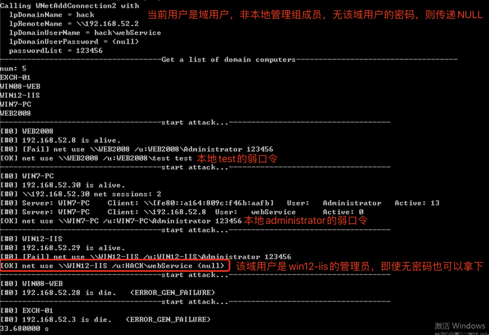
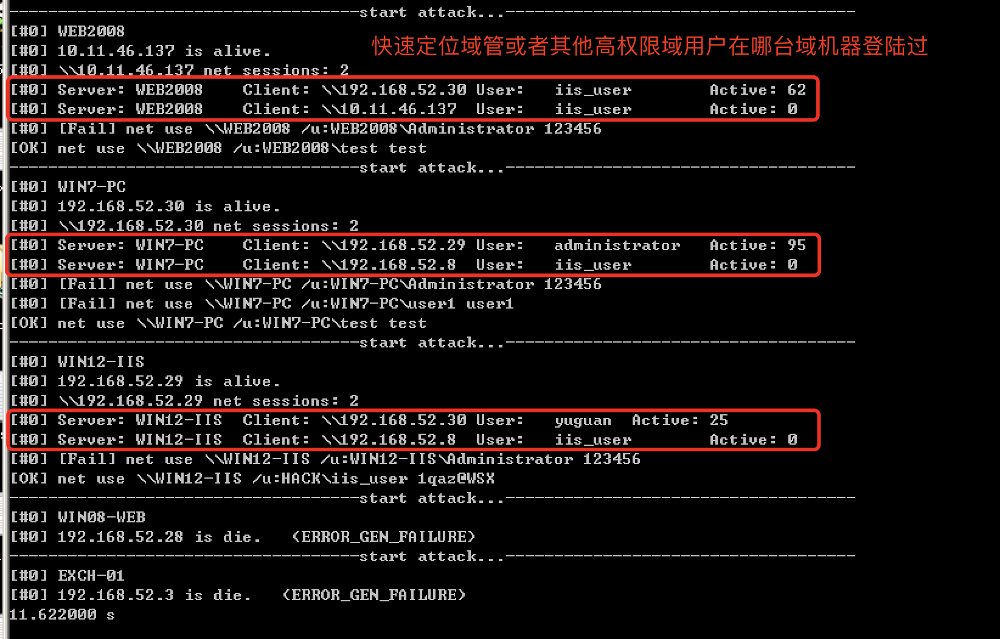
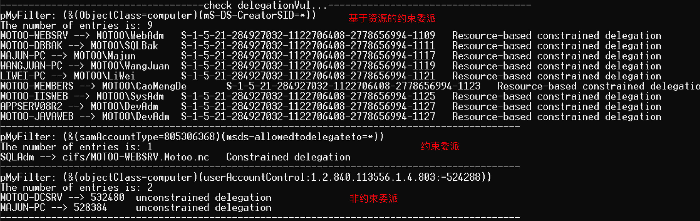
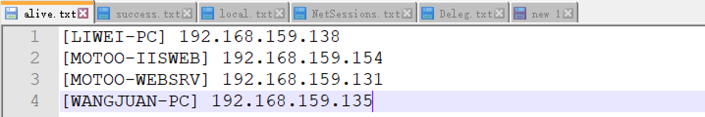
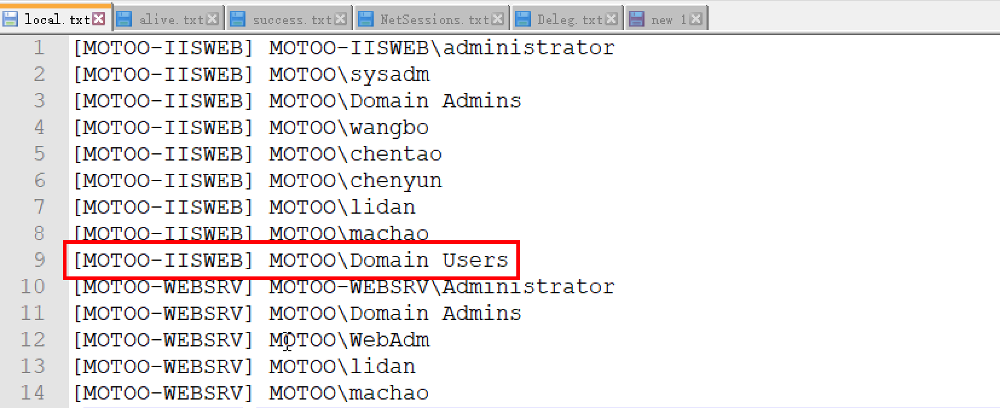
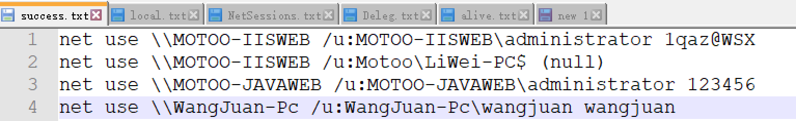
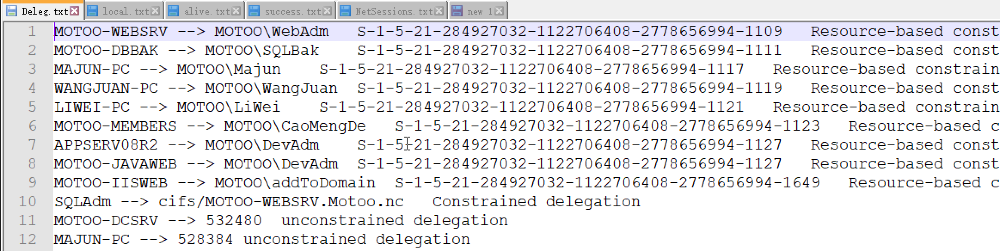
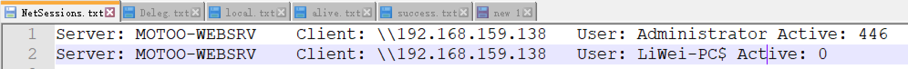
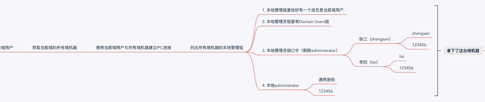
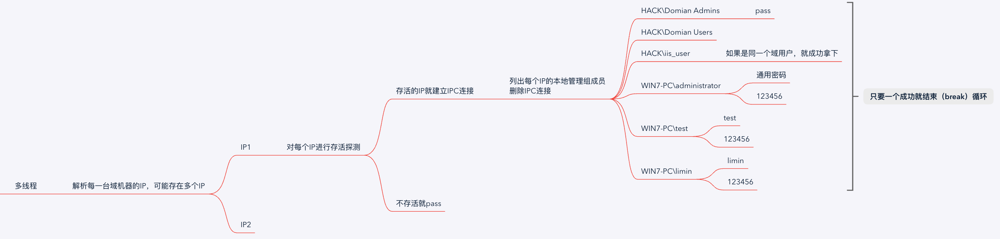

# 水影-域信息收集

[](https://github.com/0x727/ShuiYing_0x727/releases)

郑重声明：文中所涉及的技术、思路和工具仅供以安全为目的的学习交流使用，任何人不得将其用于非法用途以及盈利等目的，否则后果自行承担。

## 0x01 介绍

作者：[Ske](https://github.com/SkewwG)

团队：[0x727](https://github.com/0x727)，未来一段时间将陆续开源工具，地址：https://github.com/0x727

定位：协助红队或甲方人员评估域环境的安全性

语言：C

功能：**检测域环境内，域机器的本地管理组成员是否存在弱口令和通用口令，对域用户的权限分配以及域内委派查询**

***

这段时间有关域的漏洞层出不穷，该工具因为较早前开发，并未涉及这些漏洞，只是单纯的收集一些域内重要信息协助红队人员。那么涉及到的信息有**连通的域机器-alive.txt、域机器上的NetSessions-NetSessions.txt、域机器的本地管理员组-local.txt、域内委派成员-Deleg.txt、域机器弱口令-success.txt**。

***

### 为什么要收集这些信息呢？

假设一个场景：

* 一家企业内网，当初搭建内网环境的时候，可能并不是直接搭建域环境，而是先由一堆工作组服务器组合而成，后续机器越来越多后，才开始加入到域环境里统一管理。那么这里就抛出了一个问题，在加入域环境之前，这些服务器是否可能存在弱口令或者通用口令呢？例如：123456，P@ssw0rd等。
* 除了服务器，个人机是否也存在这个问题？例如某些员工将自己的电脑带入公司里，然后加入到了公司的域环境里。但是该员工的个人机之前是否存在弱口令呢？例如：用户名zhangsan，密码zhangsan或者123456等。虽然服务器或者个人机加入到域环境里后，域用户的密码强度都变成了强密码，但是原先本就存在的弱口令用户还是存在的。
* 某些公用域机器的本地管理组里是否有Domain Users组？倘若管理员为了方便多人用同一台域机器，将Domain Users组加入到该域机器的本地管理员组，那么红队人员是否就可以通过该台域机器获取到大量的域用户账号密码。
* 域内委派配置不当，共包含三种委派，分别是【非约束委派、约束委派、基于资源的约束委派】。当有这些域用户的权限后，也能获取到对应的域机器权限。

***

**所以只要域里域机器够多，绝大部分内网里都有几台存在这种弱口令或者通用口令。那么就通过这几台弱口令机器，先获取在当前弱口令机器登录过的域用户权限，然后再找哪些域机器的管理组里有该域用户或者就是Domain Users组，从而就相当于拿下了那些域机器。通过此方法不断的滚雪球似的，获取越来越多的域机器权限。直到获取域管用户权限，从而拿下域控**

***

后期计划：增加组策略、laps等信息的收集


## 0x02 效果展示

出现【OK】则是当前域机器的本地管理员组成员存在弱口令



对每台域机器的net session查询



查询域内的委派




收集的结果会保存在当前目录下的alive.txt, local.txt, success.txt,Deleg.txt,NetSessions.txt文本里.

alive.txt 保存存活的域机器和解析出来的IP

local.txt 保存存活域机器的本地管理组成员，**着重关注Domain Users组**

success.txt 保存爆破出弱口令的域机器的管理员账号密码，并且保存完整的ipc连接命令

Deleg.txt 保存委派的信息

NetSessions.txt 保存存活域机器的net session










## 0x03 实现原理

### 思路：

用普通的域用户权限和域控建立IPC连接，然后列出域里所有的域机器，对每一台域机器存活探测，如果存活再用当前的域用户和每一台域机器建立IPC连接，接着把每台域机器的本地管理组都取出来（域管理员，某些的域用户，某个域里的组、本地administrator，本地的其他用户），最后尝试四种方式获取该域机器权限。



### 工具流程：



### 共五种情况获取权限：

* 如果本地管理员组里的域用户列表里有当前的域用户，则拿下该域机器。
* 如果本地管理员组里有Domain Users组，则拿下该域机器。
* 用administrator的通用密码和123456尝试连接每台域机器的本地administrator用户。
* 用本地其他用户名做密码和123456尝试连接每台域机器的本地其他用户。
* 通过委派获取域机器权限（不在工具自动化里实现）
  * 约束委派获取权限：[约束委派利用](https://skewwg.github.io/2020/11/25/yue-shu-wei-pai-li-yong/)
  * 基于资源的约束委派获取权限：[基于资源的约束委派利用](https://skewwg.github.io/2020/11/25/ji-yu-zi-yuan-de-yue-shu-wei-pai-li-yong/)

### 横向扩展

从拿下的的域机器中不断的获取内存中的hash，积累域用户权限的个数，再从local.txt中寻找本地管理员组里有该域用户的域机器或者通过委派利用，然后滚雪球式的不断获取域机器权限，直到拿下域管。


## 0x04 使用方法

```
Usage: ShuiYing_0x727.exe <DC-IP> <DC> <domainname\username> <password> <nbpassword> <t_num>
       ShuiYing_0x727.exe \\域控IP 域名 域名\域用户 域用户密码 本地administrator通用密码 多线程数目
```

### 共三种情况：

* 当前webshell权限是普通域用户，并且不是该服务器的管理员权限，则password参数传递NULL，这样就会以当前域用户的权限去运行。不过该方式不会查询域内委派。
* 当前webshell是本地普通用户，但是服务器是域机器。然后我们提权到system权限后，其实就相当于是域机器权限了，这时候就可以和域内任何一台域机器建立IPC连接，并且也可以列出管理组等各种信息，那么该工具针对该场景也仍然可以适用。只要把username参数改为当前域机器的机器名，password参数传递NULL，这样就会以当前域机器的权限去运行。不过该方式不会查询域内委派。
* 指定域用户的账号密码去运行，会查询域内委派。

nbpassword参数是当你有了本地administrator通用密码时，可以使用该密码爆破。如果不知道，则传递123456.

t_num参数是线程数目


| 场景               | 语法                                                         |
| ------------------ | ------------------------------------------------------------ |
| 当前域用户权限     | ShuiYing_0x727.exe \\\192.168.159.149 Motoo.nc Motoo\liwei NULL 123456 1 |
| 当前域机器权限     | ShuiYing_0x727.exe \\\192.168.159.149 Motoo.nc Motoo\LiWei-PC$ NULL 123456 1 |
| 指定域用户账号密码 | ShuiYing_0x727.exe \\\192.168.159.149 Motoo.nc Motoo\liwei lw123!@#45 123456 1 |


## 0x05 常见错误

**error: 1219**：不允许一个用户使用一个以上用户名与服务器或共享资源的多重连接。中断与此服务器或共享资源的所有连接，然后再试一次。 

**error: 1326**：用户名或密码不正确。 

## 0x06 新增功能

无

## 0x07 反馈


水影是一个免费且开源的项目，我们欢迎任何人为其开发和进步贡献力量。

* 在使用过程中出现任何问题，可以通过 issues 来反馈。
* Bug 的修复可以直接提交 Pull Request 到 dev 分支。
* 如果是增加新的功能特性，请先创建一个 issue 并做简单描述以及大致的实现方法，提议被采纳后，就可以创建一个实现新特性的 Pull Request。
* 欢迎对说明文档做出改善，帮助更多的人使用 水影。
* 贡献代码请提交 PR 至 dev 分支，master 分支仅用于发布稳定可用版本。

**提醒：和项目相关的问题最好在 issues 中反馈，这样方便其他有类似问题的人可以快速查找解决方法，并且也避免了我们重复回答一些问题。**


## Stargazers over time

[](https://starchart.cc/0x727/ShuiYing_0x727)


